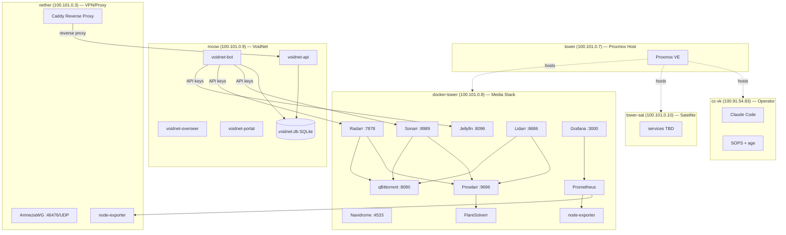
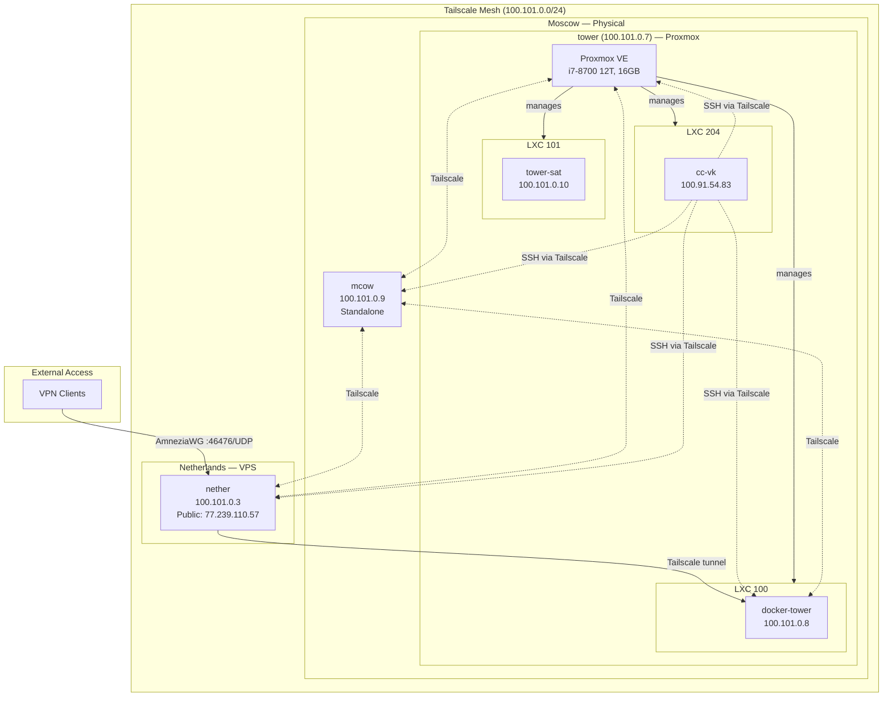

<objective>
Create the cross-server Mermaid diagrams: a service dependency map and a network topology diagram.

Purpose: INV-02 and INV-03 require visual documentation of how servers and services relate. These are the cross-cutting views that individual inventory files cannot provide. Depends on Plan 02 inventories for complete service and dependency data.
Output: docs/dependency-map.md (INV-02) and docs/network-topology.md (INV-03).
</objective>

<execution_context>
@$HOME/.claude/get-shit-done/workflows/execute-plan.md
@$HOME/.claude/get-shit-done/templates/summary.md
</execution_context>

<context>
@.planning/PROJECT.md
@.planning/ROADMAP.md
@.planning/STATE.md
@.planning/phases/01-foundations/01-CONTEXT.md
@.planning/phases/01-foundations/01-RESEARCH.md
@.planning/phases/01-foundations/01-02-SUMMARY.md
</context>

<tasks>

<task type="auto">
  <name>Task 1: Create service dependency map (docs/dependency-map.md)</name>
  <files>docs/dependency-map.md</files>
  <read_first>
    - servers/mcow/inventory.md (cross-server dependencies: mcow -> docker-tower)
    - servers/docker-tower/inventory.md (all services and ports)
    - servers/nether/inventory.md (VoidNet containers, Caddy proxy targets)
    - servers/mcow/.env.example (exact dependency variables: DOCKER_TOWER_IP, API keys)
    - servers/nether/Caddyfile (reverse proxy upstream targets)
    - servers/nether/docker-compose.void.yml (VoidNet services on nether)
  </read_first>
  <action>
Create `docs/dependency-map.md` per D-10 — a Mermaid flowchart showing service dependencies across all servers.

The file structure:

```markdown
# Service Dependency Map

Visual representation of which services depend on which across the homelab. Arrows indicate "depends on" or "calls" relationships.



## Legend

- **Solid arrows** (-->) = runtime dependency (service A calls service B)
- **Dashed arrows** (-.->)  = infrastructure relationship (host contains guest)
- **Subgraph labels** show server hostname and Tailscale IP
```

IMPORTANT: Read all inventory files and the .env.example/Caddyfile FIRST to capture every cross-server dependency. The Mermaid above is a starting template -- update it with actual dependencies found in the inventory files. Add any VoidNet-on-nether services from docker-compose.void.yml. Update Caddy proxy targets from the actual Caddyfile.

Do NOT invent dependencies that are not documented in inventory files or config files. If a dependency is unclear, add a `%% TODO: verify` comment.
  </action>
  <verify>
    <automated>cd /Users/admin/hub/workspace/homelab && test -f docs/dependency-map.md && grep -q "flowchart" docs/dependency-map.md && grep -q "docker-tower" docs/dependency-map.md && grep -q "mcow" docs/dependency-map.md && grep -q "nether" docs/dependency-map.md && echo "PASS" || echo "FAIL"</automated>
  </verify>
  <acceptance_criteria>
    - `docs/dependency-map.md` exists
    - File contains a Mermaid code block with `flowchart` directive
    - Diagram has subgraphs for all 6 servers (tower, docker-tower, tower-sat, mcow, nether, cc-vk)
    - mcow -> docker-tower dependencies shown (voidnet-bot -> jellyfin, radarr, sonarr)
    - *arr -> qBittorrent download dependencies shown
    - *arr -> prowlarr indexer dependencies shown
    - Proxmox -> LXC hosting relationships shown
    - Caddy reverse proxy targets shown (derived from actual Caddyfile)
    - File contains a Legend section explaining arrow types
  </acceptance_criteria>
  <done>Service dependency map shows all cross-server and intra-server service dependencies as a Mermaid flowchart that renders on GitHub.</done>
</task>

<task type="auto">
  <name>Task 2: Create network topology diagram (docs/network-topology.md)</name>
  <files>docs/network-topology.md</files>
  <read_first>
    - servers/tower/inventory.md (Proxmox host, LXC containers)
    - servers/nether/inventory.md (VPN endpoints, public IP)
    - servers/docker-tower/inventory.md (LXC 100)
    - servers/tower-sat/inventory.md (LXC 101)
    - servers/cc-vk/inventory.md (LXC 204)
    - CLAUDE.md (server table with all Tailscale IPs)
  </read_first>
  <action>
Create `docs/network-topology.md` per D-11 — a Mermaid diagram showing the Tailscale mesh, Proxmox LXC relationships, and VPN paths.

The file structure:

```markdown
# Network Topology

Visual representation of how all homelab servers connect. Shows the Tailscale mesh overlay, Proxmox virtualization layer, and VPN paths.



## Network Facts

| Server | Tailscale IP | Location | Type |
|--------|-------------|----------|------|
| tower | 100.101.0.7 | Moscow | Physical (Proxmox) |
| docker-tower | 100.101.0.8 | Moscow (LXC 100) | Virtual |
| tower-sat | 100.101.0.10 | Moscow (LXC 101) | Virtual |
| cc-vk | 100.91.54.83 | Moscow (LXC 204) | Virtual |
| mcow | 100.101.0.9 | Moscow | Physical/VM |
| nether | 100.101.0.3 | Netherlands | VPS |

## Access Patterns

- **Inter-server**: All communication via Tailscale mesh — no public IPs except nether's VPN endpoint
- **Operator (Claude Code)**: SSH from cc-vk to all servers via Tailscale hostnames
- **VPN users**: Connect via AmneziaWG to nether, then access docker-tower services through Tailscale tunnel
- **Proxmox management**: Direct from tower host to LXC guests
```

IMPORTANT: Read all inventory files first to capture any network details discovered during SSH queries in Plan 02. Update the diagram if any new network facts emerged (additional IPs, unexpected network paths, etc.).

Adjust the Mermaid syntax if needed for correct GitHub rendering. The nesting of subgraphs must be valid Mermaid syntax.
  </action>
  <verify>
    <automated>cd /Users/admin/hub/workspace/homelab && test -f docs/network-topology.md && grep -q "flowchart" docs/network-topology.md && grep -q "Tailscale" docs/network-topology.md && grep -q "100.101.0" docs/network-topology.md && grep -q "AmneziaWG" docs/network-topology.md && echo "PASS" || echo "FAIL"</automated>
  </verify>
  <acceptance_criteria>
    - `docs/network-topology.md` exists
    - File contains a Mermaid code block with `flowchart` directive
    - Diagram shows Tailscale mesh connecting all servers
    - Diagram shows tower as Proxmox host containing LXC 100, 101, 204
    - Diagram shows nether with public IP 77.239.110.57 and AmneziaWG on port 46476
    - Diagram shows VPN client path: external -> nether -> Tailscale -> docker-tower
    - Diagram shows cc-vk as operator with SSH access to all servers
    - File contains a Network Facts table with all 6 servers, their Tailscale IPs, locations, and types
    - File contains an Access Patterns section
  </acceptance_criteria>
  <done>Network topology diagram shows Tailscale mesh, Proxmox LXC nesting, VPN paths, and operator access patterns. Renders as Mermaid on GitHub.</done>
</task>

</tasks>

<threat_model>
## Trust Boundaries

| Boundary | Description |
|----------|-------------|
| docs/ published content | Diagrams contain internal IPs and network structure |

## STRIDE Threat Register

| Threat ID | Category | Component | Disposition | Mitigation Plan |
|-----------|----------|-----------|-------------|-----------------|
| T-03-01 | Information Disclosure | network-topology.md | accept | Contains Tailscale IPs (internal only, not routable from internet) and one public IP (nether, already exposed by design). Repo is private. Risk is low. |
| T-03-02 | Information Disclosure | dependency-map.md | accept | Contains service names and ports, no secrets. Repo is private. |
</threat_model>

<verification>
1. `test -f docs/dependency-map.md` -- dependency map exists
2. `test -f docs/network-topology.md` -- network topology exists
3. `grep -q "flowchart" docs/dependency-map.md` -- valid Mermaid
4. `grep -q "flowchart" docs/network-topology.md` -- valid Mermaid
5. Both files reference all 6 servers
6. Dependency map shows cross-server arrows (mcow -> docker-tower)
7. Network topology shows Proxmox LXC nesting and VPN path
</verification>

<success_criteria>
- docs/dependency-map.md has a complete Mermaid flowchart of service dependencies
- docs/network-topology.md has a complete Mermaid diagram of network topology
- Both render correctly as Mermaid on GitHub (valid syntax)
- All 6 servers appear in both diagrams
- Cross-server dependencies from inventory files are reflected in the dependency map
- Tailscale mesh, LXC relationships, and VPN paths are shown in the topology
</success_criteria>

<output>
After completion, create `.planning/phases/01-foundations/01-03-SUMMARY.md`
</output>
