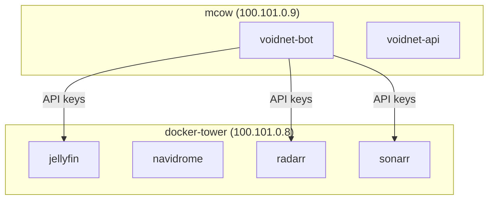

# Phase 1: Foundations - Research

**Researched:** 2026-04-13
**Domain:** Secrets management (SOPS+age), repo structure, server inventory documentation, Mermaid diagrams
**Confidence:** HIGH

<user_constraints>
## User Constraints (from CONTEXT.md)

### Locked Decisions
- **D-01:** Hybrid layout — `servers/{hostname}/` for per-server configs and inventory, `shared/` for cross-cutting concerns, `docs/` for cross-server documentation
- **D-02:** Cross-server docs (dependency map, network topology, architecture) live in `docs/` at repo root
- **D-03:** Consolidate `docker-tower/` (root-level) into `servers/docker-tower/` — one canonical location per server
- **D-04:** `.sops.yaml` lives at hub repo root (`../` relative to homelab) — all projects share one SOPS config
- **D-05:** Encrypted value files pattern — `secrets/` directory with SOPS-encrypted YAML files (e.g., `secrets/docker-tower.sops.yaml`). Compose files reference via env_file or variable substitution
- **D-06:** Age private key lives only on operator machines (cc-vk and local dev). Never committed. Decrypt happens at deploy time
- **D-07:** Inventory format is Markdown — `inventory.md` per server in `servers/{hostname}/`
- **D-08:** Required inventory fields: hostname, Tailscale IP, role, hardware specs, hosted services with ports, storage layout, access info
- **D-09:** Claude has discretion on additional per-server fields
- **D-10:** Service dependency map as Mermaid flowchart in `docs/dependency-map.md`
- **D-11:** Network topology as Mermaid diagram in `docs/network-topology.md`

### Claude's Discretion
- Additional inventory fields per server beyond required set (D-09)
- Mermaid diagram style choices (flowchart direction, grouping, color coding)
- `shared/` directory internal structure
- `.gitignore` additions beyond what already exists for secrets patterns

### Deferred Ideas (OUT OF SCOPE)
- None — discussion stayed within phase scope
</user_constraints>

<phase_requirements>
## Phase Requirements

| ID | Description | Research Support |
|----|-------------|------------------|
| SEC-01 | SOPS + age secrets pattern established at hub level with homelab referencing encrypted values | SOPS 3.12.1 + age 1.3.1 already installed on operator machine; hub root has no .sops.yaml yet — Wave 0 creates it |
| SEC-02 | .gitignore patterns prevent secrets, .env files, and credentials from ever being committed | Current .gitignore covers `.env`, `*.key`, `*.pem`; needs additions for `*.sops.yaml` decrypted outputs and `secrets/` raw files |
| INV-01 | Complete server inventory documents all 6 servers with hardware specs, roles, Tailscale IPs, and hosted services | All 6 servers identified; running-containers.txt provides docker-tower service list; CLAUDE.md has Tailscale IPs and roles for all |
| INV-02 | Service dependency map shows what depends on what across all servers | mcow .env.example reveals cross-server dependencies (DOCKER_TOWER_IP, API keys to docker-tower services); nether hosts VoidNet Caddy proxy |
| INV-03 | Network topology diagram visualizes how servers connect (Tailscale mesh, Proxmox LXCs, VPN paths) | Tailscale IPs and LXC IDs known; tower hosts LXC 100 (docker-tower) and LXC 101 (tower-sat); cc-vk is LXC 204 |
</phase_requirements>

---

## Summary

Phase 1 is a documentation and scaffolding phase — no services are deployed, no Ansible playbooks run. The work is: (1) establish the SOPS+age secrets pattern at hub level, (2) harden .gitignore, (3) create per-server `inventory.md` files for all 6 servers, and (4) write two cross-server Mermaid diagrams.

All required tools are already installed on the operator machine: sops 3.12.1 and age 1.3.1. No hub-level `.sops.yaml` exists yet — that is the primary blocking artifact to create. The existing repo structure (`servers/{hostname}/`) is the right foundation; it just needs `inventory.md` files added and the `docker-tower/` duplicate removed.

The biggest information gap is hardware specs for servers where no config file exists yet (tower-sat, cc-vk, mcow, nether hardware details). These will require SSH queries or best-effort documentation from known facts.

**Primary recommendation:** Wave 0 creates the `.sops.yaml` at hub root and the `secrets/` directory scaffold. Subsequent waves write inventory docs in parallel (one per server), then assemble the two cross-server diagrams last when all inventory facts are in hand.

---

## Standard Stack

### Core
| Tool | Version | Purpose | Source |
|------|---------|---------|--------|
| SOPS | 3.12.1 (installed) | Encrypt secret YAML files committed to git | [VERIFIED: `sops --version` on operator machine] |
| age | 1.3.1 (installed) | Encryption backend for SOPS | [VERIFIED: `age --version` on operator machine] |
| Mermaid | n/a (markdown syntax) | Dependency map and network topology diagrams rendered by GitHub | [ASSUMED] |

### No Installation Required
This phase is documentation + scaffolding. No new packages need to be installed. SOPS and age are already present.

---

## Architecture Patterns

### Repo Structure After Phase 1

```
homelab/
  .gitignore                    # augmented for secrets patterns
  servers/
    tower/
      inventory.md              # NEW — hardware, LXC layout, Proxmox role
      lxc-100-docker-tower.conf # existing
      lxc-101-tower-sat.conf    # existing
    docker-tower/
      inventory.md              # NEW — all containers, ports, data paths
      docker-compose.homestack.yml  # existing
      docker-compose.services.yml   # existing
      docker-compose.monitoring.yml # existing
      running-containers.txt        # existing
    tower-sat/
      inventory.md              # NEW — services TBD (currently minimal)
    mcow/
      inventory.md              # NEW — VoidNet services, SQLite DB paths
      .env.example              # existing
      voidnet-*.service         # existing systemd units
    nether/
      inventory.md              # NEW — VPN endpoints, Caddy proxy
      Caddyfile                 # existing
      docker-compose.void.yml   # existing
      docker-compose.monitoring.yml # existing
    cc-vk/
      inventory.md              # NEW — LXC 204, vibe-kanban, Claude Code runner
  docs/
    dependency-map.md           # NEW — Mermaid flowchart (INV-02)
    network-topology.md         # NEW — Mermaid diagram (INV-03)
  docker-tower/
    .gitkeep                    # REMOVE — migrate to servers/docker-tower/
secrets/                        # NEW — SOPS-encrypted YAML files (empty initially)
  .gitkeep
```

Hub root (one level up, `../`):
```
hub/
  .sops.yaml                    # NEW — shared SOPS config, age recipient
```

### Pattern: SOPS Encrypted Secrets File

```yaml
# .sops.yaml at hub root — controls encryption for all sub-repos
creation_rules:
  - path_regex: .*/secrets/.*\.sops\.yaml$
    age: >-
      age1<OPERATOR_PUBLIC_KEY>
```

[ASSUMED] — standard SOPS age pattern; exact public key must come from operator's age key file (`~/.config/sops/age/keys.txt` or equivalent).

```yaml
# secrets/docker-tower.sops.yaml (encrypted at rest, plaintext shown for illustration)
jellyfin_api_key: ENC[AES256_GCM,...]
radarr_api_key: ENC[AES256_GCM,...]
```

### Pattern: .gitignore Additions for Secrets

The current `.gitignore` covers `.env`, `*.key`, `*.pem`. Phase 1 must add:

```gitignore
# SOPS decrypted outputs (never commit plaintext)
secrets/*.yaml
!secrets/*.sops.yaml

# age key material
*.age
keys.txt
```

[VERIFIED: SOPS convention] — `.sops.yaml` files ARE committed (they contain encrypted values). Plaintext YAML counterparts are NOT committed.

### Pattern: Per-Server inventory.md

Required fields per D-08:

```markdown
# {hostname}

| Field | Value |
|-------|-------|
| Hostname | {hostname} |
| Tailscale IP | {ip} |
| Role | {description} |
| Hardware | {CPU, RAM, disk} |
| Access | `ssh root@{hostname}` via Tailnet |

## Hosted Services

| Service | Port | Image/Binary | Notes |
|---------|------|-------------|-------|
| {name} | {port} | {image} | {notes} |

## Storage Layout

| Path | Purpose | Stateful Data |
|------|---------|--------------|
| {path} | {purpose} | {what lives here} |

## Notes

{anything non-obvious about this server}
```

### Pattern: Mermaid Dependency Map



[ASSUMED] — Mermaid flowchart syntax; GitHub renders natively.

---

## Don't Hand-Roll

| Problem | Don't Build | Use Instead | Why |
|---------|-------------|-------------|-----|
| Secret encryption | Custom encryption scripts | SOPS + age (already installed) | Key rotation, git diff-friendly, multi-recipient |
| Diagram rendering | Image files / draw.io exports | Mermaid in Markdown | Version-controllable, AI-readable, GitHub-native |
| Inventory format | Custom JSON/YAML schema | Markdown tables | Human-readable, AI-readable, no tooling required |

---

## Common Pitfalls

### Pitfall 1: Committing .sops.yaml Before age Key Exists
**What goes wrong:** Running `sops encrypt` without a valid age recipient key configured produces an error or silently produces an unusable file.
**Why it happens:** `.sops.yaml` references a public key that hasn't been generated yet.
**How to avoid:** Generate age key first (`age-keygen`), capture the public key, then write `.sops.yaml` with that recipient. Document the key fingerprint in a non-secret location.
**Warning signs:** `sops` errors about "no matching creation rules" or "no keys found".

### Pitfall 2: Secrets Directory Pattern Confusion
**What goes wrong:** `secrets/*.sops.yaml` (encrypted, COMMITTED) vs `secrets/*.yaml` (plaintext, NOT committed) naming gets reversed.
**Why it happens:** The `.sops.yaml` suffix is the encrypted form — counterintuitive.
**How to avoid:** .gitignore rule: `secrets/*.yaml` (block all) + `!secrets/*.sops.yaml` (allow encrypted only). Test with `git status` after adding a test file.

### Pitfall 3: docker-tower/ Root Directory Duplication
**What goes wrong:** `docker-tower/` at repo root is a legacy artifact with only a `.gitkeep`. Leaving it creates confusion about canonical location.
**Why it happens:** It exists in the repo now (verified: `/homelab/docker-tower/.gitkeep`).
**How to avoid:** D-03 decision requires consolidating to `servers/docker-tower/`. Remove `docker-tower/` root directory as part of Wave 0 repo scaffolding.

### Pitfall 4: Hub .sops.yaml Scope
**What goes wrong:** Placing `.sops.yaml` inside the homelab repo means other sibling repos (animaya, voidnet) can't share it.
**Why it happens:** Easy to put config next to the secrets files.
**How to avoid:** D-04 is locked — `.sops.yaml` goes at `/Users/admin/hub/workspace/.sops.yaml` or `/Users/admin/hub/.sops.yaml`. Verify which level is the actual hub root. Current `hub/` contains `workspace/`, `backlog/`, `knowledge/` — the hub root is `/Users/admin/hub/`.

### Pitfall 5: Missing Hardware Specs for Some Servers
**What goes wrong:** tower-sat, cc-vk hardware details are not documented anywhere in the repo.
**Why it happens:** These servers have no config files yet.
**How to avoid:** Use SSH to query each server during inventory writing (`lscpu`, `free -h`, `df -h`, `uname -r`). Plan tasks must include SSH fact-gathering steps for each server.

---

## Runtime State Inventory

> This is not a rename/refactor phase — this section is not applicable.

---

## Environment Availability

| Dependency | Required By | Available | Version | Fallback |
|------------|------------|-----------|---------|----------|
| sops | SEC-01 secrets encryption | Yes | 3.12.1 | — |
| age | SEC-01 encryption backend | Yes | 1.3.1 | — |
| SSH to all 6 servers | INV-01 hardware fact gathering | Assumed (Tailscale mesh) | — | Document from memory / CLAUDE.md |
| git | All tasks | Yes (repo exists) | — | — |

**Missing dependencies with no fallback:** None.

**Key note:** Hub root `.sops.yaml` does NOT exist yet (`/Users/admin/hub/.sops.yaml` — not found). This is Wave 0 work, not a blocker that requires human action before planning proceeds.

---

## Validation Architecture

### Test Framework
| Property | Value |
|----------|-------|
| Framework | None — this phase produces only documentation and config files, not executable code |
| Config file | n/a |
| Quick run command | `git status && git diff --stat` (verify no unencrypted secrets staged) |
| Full suite command | `grep -r "REDACTED\|password\|token\|secret" secrets/ 2>/dev/null \|\| echo "No plaintext secrets found"` |

### Phase Requirements → Test Map

| Req ID | Behavior | Test Type | Automated Command | File Exists? |
|--------|----------|-----------|-------------------|--------------|
| SEC-01 | `.sops.yaml` exists at hub root with age recipient | smoke | `test -f /Users/admin/hub/.sops.yaml && echo PASS` | Wave 0 creates |
| SEC-01 | `secrets/docker-tower.sops.yaml` can be encrypted/decrypted | smoke | `sops --decrypt homelab/secrets/docker-tower.sops.yaml` | Wave 0 creates |
| SEC-02 | `.gitignore` blocks plaintext YAML in secrets/ | smoke | `echo "test: val" > secrets/test.yaml && git status \| grep -q "secrets/test.yaml" \|\| echo BLOCKED` | Wave 0 augments |
| INV-01 | All 6 inventory.md files exist with required fields | smoke | `for h in tower docker-tower tower-sat mcow nether cc-vk; do test -f servers/$h/inventory.md && echo "$h OK"; done` | Waves 1-2 create |
| INV-02 | dependency-map.md exists with valid Mermaid block | smoke | `grep -q "flowchart\|graph" docs/dependency-map.md && echo PASS` | Wave 3 creates |
| INV-03 | network-topology.md exists with valid Mermaid block | smoke | `grep -q "flowchart\|graph" docs/network-topology.md && echo PASS` | Wave 3 creates |

### Sampling Rate
- **Per task commit:** `git status` to verify no unintended files staged
- **Per wave merge:** Run all smoke tests above
- **Phase gate:** All 6 smoke tests green before `/gsd-verify-work`

### Wave 0 Gaps
- [ ] Smoke test script `scripts/verify-phase1.sh` — covers all REQ checks above
- [ ] No framework install needed (shell only)

---

## Security Domain

### Applicable ASVS Categories

| ASVS Category | Applies | Standard Control |
|---------------|---------|-----------------|
| V2 Authentication | No | n/a (no auth surfaces in this phase) |
| V3 Session Management | No | n/a |
| V4 Access Control | No | n/a |
| V5 Input Validation | No | n/a (no code, no inputs) |
| V6 Cryptography | Yes | SOPS + age (AES256-GCM + X25519) — never hand-roll |

### Known Threat Patterns

| Pattern | STRIDE | Standard Mitigation |
|---------|--------|---------------------|
| Plaintext secrets committed to git | Information Disclosure | .gitignore + SOPS encrypted-only pattern; pre-commit check |
| age private key exposure | Information Disclosure | Key never committed; lives only on operator machines (D-06) |
| .sops.yaml missing recipient (secrets locked to lost key) | Denial of Service | Document age public key fingerprint in non-secret location; consider two recipients (cc-vk + local dev) |

---

## Key Facts Collected About Each Server

### tower (100.101.0.7)
- Proxmox host, i7-8700 12C, 16GB RAM [CITED: CLAUDE.md]
- Hosts LXC 100 (docker-tower, 100.101.0.8) and LXC 101 (tower-sat, 100.101.0.10) [CITED: CLAUDE.md + lxc conf files]
- LXC configs: `lxc-100-docker-tower.conf`, `lxc-101-tower-sat.conf` already in repo [VERIFIED: file exists]

### docker-tower (100.101.0.8)
- LXC 100 on tower [CITED: CLAUDE.md]
- Running containers (2026-04-10 snapshot): navidrome, slskd, prowlarr, grafana, prometheus, node-exporter x2, lidarr, jellyfin, filebrowser, qbittorrent, sonarr, radarr, personal-page, docker-tower-api, flaresolverr, portainer_agent, workspace containers [VERIFIED: running-containers.txt]
- Ports: Jellyfin :8096, Navidrome :4533, qBit :8080, Radarr :7878, Sonarr :8989, Lidarr :8686, Prowlarr :9696, Grafana :3000, FileBrowser :8081 [VERIFIED: running-containers.txt]

### mcow (100.101.0.9)
- VoidNet bot, API, portal, SQLite DB [CITED: CLAUDE.md]
- Systemd services: voidnet-api, voidnet-bot, voidnet-overseer, voidnet-satellite [VERIFIED: .service files exist]
- Cross-server deps: calls docker-tower services via Tailscale IP (DOCKER_TOWER_IP=100.101.0.8) [VERIFIED: .env.example]
- DB path: /opt/voidnet/voidnet.db [VERIFIED: .env.example]
- Hardware: unknown — needs SSH query

### nether (100.101.0.3, Netherlands)
- VPN entry/exit: AmneziaWG, Caddy reverse proxy [CITED: CLAUDE.md]
- Running: VoidNet-related compose, monitoring compose [VERIFIED: docker-compose files exist]
- Public IP: 77.239.110.57, AWG port 46476 [VERIFIED: .env.example NETHER_PUBLIC_IP + AWG_PORT]
- Hardware: unknown — needs SSH query

### tower-sat (100.101.0.10)
- LXC 101 on tower [CITED: CLAUDE.md]
- Services: minimal/unknown — needs SSH query
- Hardware: unknown — needs SSH query

### cc-vk (100.91.54.83, LXC 204)
- Vibe Kanban host, Claude Code runner [CITED: CLAUDE.md]
- This is the operator machine where research is being run
- Hardware: unknown — needs SSH query (or inspect locally since this IS cc-vk)

---

## Assumptions Log

| # | Claim | Section | Risk if Wrong |
|---|-------|---------|---------------|
| A1 | Mermaid renders natively on GitHub without plugins | Standard Stack | Diagrams show as raw text; would need alternative (ASCII art or image export) |
| A2 | age key already exists on this operator machine at standard path | Environment Availability | Wave 0 task must generate key if absent; `age-keygen -o ~/.config/sops/age/keys.txt` |
| A3 | Hub .sops.yaml should live at `/Users/admin/hub/.sops.yaml` (not `/Users/admin/hub/workspace/.sops.yaml`) | Architecture Patterns | SOPS path_regex in creation_rules must match relative paths of encrypted files |
| A4 | tower-sat has minimal/no services currently | Key Facts | Inventory doc may be sparse; acceptable per D-09 discretion |
| A5 | `REALITY_PUBLIC_KEY` / `REALITY_SHORT_ID` in .env.example are XRay/VLESS remnants — out of scope | Key Facts | If still active on nether, nether inventory must document them |

---

## Open Questions

1. **Where exactly does the hub .sops.yaml live?**
   - What we know: D-04 says "hub repo root (`../` relative to homelab)". Homelab is at `/Users/admin/hub/workspace/homelab/`. Parent is `/Users/admin/hub/workspace/`. Hub root appears to be `/Users/admin/hub/`.
   - What's unclear: Is the intended location `/Users/admin/hub/.sops.yaml` or `/Users/admin/hub/workspace/.sops.yaml`?
   - Recommendation: Use `/Users/admin/hub/.sops.yaml` (true hub root, one level above all workspace projects). If that's wrong, it's a one-line path change.

2. **Does an age key already exist on this machine?**
   - What we know: SOPS and age are installed. No .sops.yaml found.
   - What's unclear: Whether `~/.config/sops/age/keys.txt` exists with an age identity.
   - Recommendation: Wave 0 task checks for key existence before generating; if exists, extract public key for `.sops.yaml`.

3. **tower-sat current services?**
   - What we know: LXC 101, Tailscale IP 100.101.0.10. No config files in repo.
   - What's unclear: What (if anything) runs on tower-sat today.
   - Recommendation: SSH `ssh root@tower-sat "docker ps; systemctl list-units --state=running"` during INV-01 task.

---

## Sources

### Primary (HIGH confidence)
- `servers/docker-tower/running-containers.txt` — verified container list with ports (2026-04-10 snapshot)
- `servers/mcow/.env.example` — verified cross-server dependency vars and service config
- `servers/tower/lxc-100-docker-tower.conf`, `lxc-101-tower-sat.conf` — verified LXC existence
- `CLAUDE.md` — verified server table (hostnames, Tailscale IPs, roles, hardware for tower)
- `sops --version` on operator machine — verified 3.12.1
- `age --version` on operator machine — verified 1.3.1

### Secondary (MEDIUM confidence)
- SOPS official docs (getsops/sops) — .sops.yaml creation_rules pattern [CITED: github.com/getsops/sops]
- STACK.md in .planning/research — prior research on secrets management decisions

### Tertiary (LOW confidence)
- Mermaid GitHub rendering — assumed from general knowledge [ASSUMED: A1]
- Hardware specs for tower-sat, cc-vk, mcow, nether — not yet queried [ASSUMED]

---

## Metadata

**Confidence breakdown:**
- Standard Stack: HIGH — tools verified installed, versions confirmed
- Architecture: HIGH — all decisions locked in CONTEXT.md, repo structure verified
- Pitfalls: HIGH — derived from actual repo state (docker-tower/ duplicate confirmed, .gitignore gaps confirmed)
- Server facts (docker-tower, mcow): HIGH — verified from existing files
- Server facts (tower-sat, cc-vk, nether hardware): LOW — SSH queries needed

**Research date:** 2026-04-13
**Valid until:** 2026-05-13 (stable domain; tool versions won't change materially in 30 days)
