# Service Dependency Map

> 2026-04-14: tower-sat (LXC 101) decommissioned — see REQUIREMENTS.md SVC-06 invalidated.

Visual representation of which services depend on which across the homelab. Arrows indicate "depends on" or "calls" relationships.

```mermaid
flowchart TD
  subgraph tower["tower (100.101.0.7) — Proxmox Host"]
    proxmox[Proxmox VE :8006]
  end

  subgraph docker-tower["docker-tower (100.101.0.8) — Media Stack"]
    jellyfin[Jellyfin :8096]
    navidrome[Navidrome :4533]
    radarr[Radarr :7878]
    sonarr[Sonarr :8989]
    lidarr[Lidarr :8686]
    prowlarr[Prowlarr :9696]
    qbit[qBittorrent :8080]
    flaresolverr[FlareSolverr :8191]
    slskd[slskd :5030]
    filebrowser[FileBrowser :8081]
    personal-page[personal-page :8085]
    dt-api[docker-tower-api]
    grafana-dt[Grafana :3000]
    prometheus-dt[Prometheus :9090]
    node-exp-dt[node-exporter :9100]
    dockerproxy[dockerproxy]
    portainer-agent[Portainer Agent :9001]
  end

  subgraph mcow["mcow (100.101.0.9) — VoidNet"]
    voidnet-bot[voidnet-bot]
    voidnet-api[voidnet-api :8080]
    voidnet-overseer[voidnet-overseer]
    voidnet-satellite[voidnet-satellite]
    voidnet-portal[voidnet-portal]
    pocketbase[PocketBase/Notes :8090]
    animaya-api[Animaya API :8090]
    animaya-fe[Animaya Frontend :3090]
    socks5[SOCKS5 proxy :1080]
    voidnet-db[(voidnet.db SQLite)]
  end

  subgraph nether["nether (100.101.0.3) — VPN/Proxy"]
    amnezia[AmneziaWG :46476/UDP]
    caddy[Caddy :80/:443/:2053]
    void-overseer-n[void-overseer :8000]
    void-uplink[void-uplink :8001]
    n8n[n8n :5678]
    spacetimedb[SpacetimeDB :3000]
    couchdb[CouchDB :5984]
    x-ui[x-ui :2053]
    prometheus-n[Prometheus :9090]
    grafana-n[Grafana :3001]
    node-exp-n[node-exporter :9100]
  end

  subgraph cc-vk["cc-vk (100.91.54.83) — Operator"]
    claude-code[Claude Code]
    sops-age[SOPS + age]
    vibe-kanban[Vibe Kanban]
  end

  %% Proxmox hosts LXCs
  proxmox -.->|hosts LXC 100| docker-tower
  proxmox -.->|hosts LXC 204| cc-vk

  %% mcow -> docker-tower cross-server dependencies
  voidnet-bot -->|JELLYFIN_API_KEY| jellyfin
  voidnet-bot -->|RADARR_API_KEY| radarr
  voidnet-bot -->|SONARR_API_KEY| sonarr
  voidnet-bot -->|LIDARR_API_KEY| lidarr
  voidnet-bot -->|NAVIDROME_ADMIN_PASS| navidrome

  %% mcow -> nether cross-server dependency
  voidnet-bot -->|SSH + AWG_CONTAINER| amnezia

  %% VoidNet internal dependencies
  voidnet-api --> voidnet-db
  voidnet-bot --> voidnet-db
  voidnet-bot --> socks5

  %% *arr -> qBittorrent download client
  radarr --> qbit
  sonarr --> qbit
  lidarr --> qbit

  %% *arr -> prowlarr indexer
  radarr --> prowlarr
  sonarr --> prowlarr
  lidarr --> prowlarr

  %% prowlarr -> flaresolverr captcha bypass
  prowlarr --> flaresolverr

  %% Monitoring on docker-tower
  prometheus-dt --> node-exp-dt
  grafana-dt --> prometheus-dt

  %% Monitoring on nether
  prometheus-n --> node-exp-n
  grafana-n --> prometheus-n

  %% Caddy reverse proxy routes (from nether Caddyfile)
  caddy -->|voidnet.makscee.ru| voidnet-api
  caddy -->|voidnet.makscee.ru/jellyfin/*| jellyfin
  caddy -->|voidnet.makscee.ru/navidrome*| navidrome
  caddy -->|makscee.ru| personal-page
  caddy -->|notes.makscee.ru| pocketbase
  caddy -->|animaya.makscee.ru| animaya-fe
  caddy -->|animaya.makscee.ru/api/*| animaya-api
  caddy -->|n8n.makscee.ru| n8n
  caddy -->|aoi.makscee.ru:3000| spacetimedb
  caddy -->|sync.makscee.ru| couchdb
```

## Legend

- **Solid arrows** (`-->`) = runtime dependency (service A calls or routes to service B)
- **Dashed arrows** (`-.->`) = infrastructure relationship (host contains/manages guest)
- **Subgraph labels** show server hostname and Tailscale IP
- **Bold node labels** include port numbers where applicable

## Cross-Server Dependencies Summary

| From | To | Protocol | Purpose |
|------|----|----------|---------|
| voidnet-bot (mcow) | jellyfin (docker-tower :8096) | HTTP + API key | Media library integration |
| voidnet-bot (mcow) | radarr (docker-tower :7878) | HTTP + API key | Movie requests |
| voidnet-bot (mcow) | sonarr (docker-tower :8989) | HTTP + API key | TV show requests |
| voidnet-bot (mcow) | lidarr (docker-tower :8686) | HTTP + API key | Music automation |
| voidnet-bot (mcow) | navidrome (docker-tower :4533) | HTTP + admin pass | Music library |
| voidnet-bot (mcow) | amnezia (nether) | SSH + AWG_CONTAINER | VPN peer management |
| caddy (nether) | voidnet-api (mcow :8080) | HTTP reverse proxy | VoidNet API public access |
| caddy (nether) | jellyfin (docker-tower :8096) | HTTP reverse proxy | VoidNet Jellyfin public access |
| caddy (nether) | navidrome (docker-tower :4533) | HTTP reverse proxy | VoidNet Navidrome public access |
| caddy (nether) | personal-page (docker-tower :8085) | HTTP reverse proxy | makscee.ru |
| caddy (nether) | pocketbase (mcow :8090) | HTTP reverse proxy | notes.makscee.ru |
| caddy (nether) | animaya-fe (mcow :3090) | HTTP reverse proxy | animaya.makscee.ru |
| caddy (nether) | animaya-api (mcow :8090) | HTTP reverse proxy | animaya.makscee.ru/api/* |
