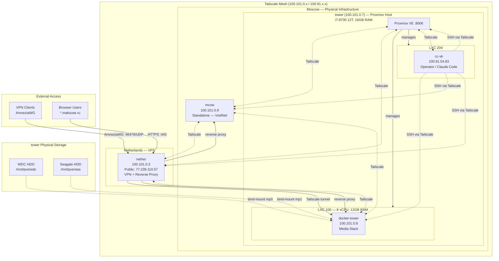

# Network Topology

> 2026-04-14: tower-sat (LXC 101) decommissioned — see REQUIREMENTS.md SVC-06 invalidated.

Visual representation of how all homelab servers connect. Shows the Tailscale mesh overlay, Proxmox virtualization layer, and VPN paths.

## Network Facts

| Server | Tailscale IP | Public IP | Location | Type | Resources |
|--------|-------------|-----------|----------|------|-----------|
| tower | 100.101.0.7 | — | Moscow | Physical (Proxmox host) | i7-8700 12T, 16GB RAM |
| docker-tower | 100.101.0.8 | — | Moscow (LXC 100) | Virtual | 8 vCPU, 12GB RAM |
| cc-vk | 100.91.54.83 | — | Moscow (LXC 204) | Virtual | Pending SSH query |
| mcow | 100.101.0.9 | — | Moscow | Standalone | Pending SSH query |
| nether | 100.101.0.3 | 77.239.110.57 | Netherlands | VPS | Pending SSH query |

## Access Patterns

- **Inter-server**: All communication via Tailscale mesh — no public IPs used except nether's VPN endpoint
- **Operator (Claude Code)**: SSH from cc-vk to all servers via Tailscale hostnames (`ssh root@<hostname>`)
- **VPN users**: Connect via AmneziaWG (:46476/UDP) to nether, then access docker-tower services through Tailscale tunnel
- **Public domains**: All `*.makscee.ru` traffic terminates TLS at nether's Caddy, then proxied to mcow or docker-tower via Tailscale
- **Proxmox management**: Direct from tower host to LXC guests; Proxmox UI at tower:8006
- **Media access (VoidNet)**: VPN clients reach Jellyfin (:8096) and Navidrome (:4533) on docker-tower via nether reverse proxy

## Key Network Risks

| Risk | Description |
|------|-------------|
| nether SPOF | If nether goes down: all public VPN access lost, all `*.makscee.ru` domains unreachable |
| cc-vk SPOF | If cc-vk goes down: no Claude Code execution, no deployments until operator machine rebuilt with age key |
| voidnet.db on mcow | Single copy of critical user data — no replication, no backup currently defined |
